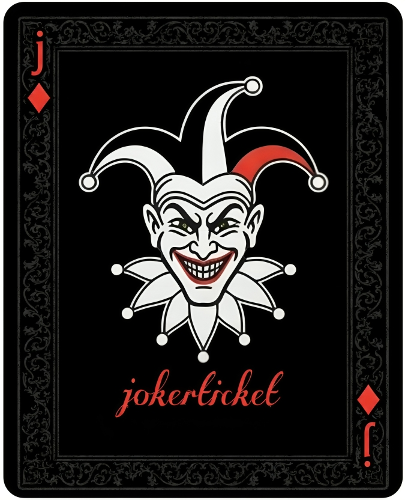

# 🃏 JokerTicket – AD Pentesting Framework

## 📌 Overview

**JokerTicket** is a modular Active Directory penetration testing framework designed for security assessment, red teaming simulations, and educational purposes.

It provides a unified interface to execute various AD attack techniques

🚀 Installation
🔹 1. Clone Repository
git clone https://github.com/s1m193/JokerTicket.git
cd JokerTicket
🔹 2. Install Dependencies
pip install -r requirements.txt
🔹 3. Install as CLI Tool (Global Command)
pip install .

After installation you can run:

jokerticket

from anywhere in your system.
